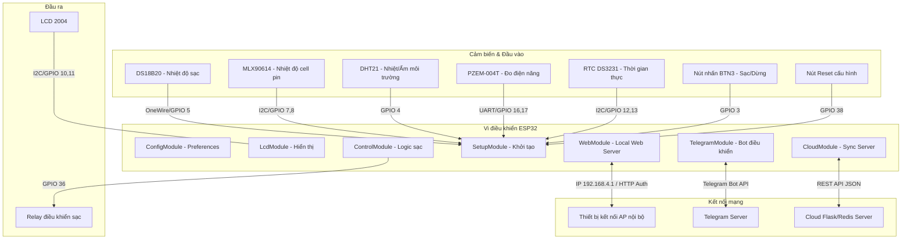
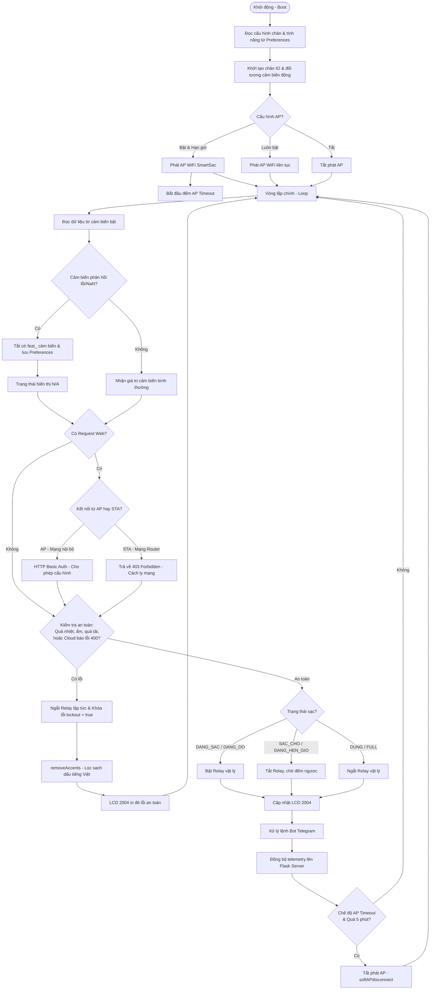

# Tài Liệu Hướng Dẫn Chi Tiết Mã Nguồn ESP32 (Smart Charger)

Tài liệu này mô tả chi tiết kiến trúc, các mô-đun chức năng, cơ chế vận hành, và cấu hình nâng cao trong phần mềm điều khiển trạm sạc thông minh chạy trên ESP32.

---

## 1. Cấu Trúc Mã Nguồn (File Structure)

Phần mềm được tổ chức thành các file tiêu đề (`.h`) chia nhỏ nhiệm vụ, tất cả được liên kết và biên dịch trong `sketch_nov25a.ino`.

*   **`sketch_nov25a.ino`**: Điểm khởi đầu chính (setup & loop). Khai báo các đối tượng phần cứng dưới dạng con trỏ (pointers) và chạy luồng điều khiển sạc chính.
*   **`PinConfig.h`**: Chứa định nghĩa chân kết nối mặc định của tất cả các cảm biến và thiết bị ngoại vi.
*   **`FeaturesConfig.h`**: Chứa các cờ bật/tắt mặc định (True/False) cho từng cảm biến hoặc tính năng hệ thống.
*   **`ConfigModule.h`**: Quản lý cấu hình toàn cục, load/save cấu hình và trạng thái bật/tắt tính năng từ bộ nhớ không bay hơi `Preferences`.
*   **`SetupModule.h`**: Thiết lập dịch vụ boot, khởi tạo chân IO vật lý và các đối tượng cảm biến động dựa trên cấu hình chân, cấu hình các route Web Server.
*   **`ControlModule.h`**: Xử lý logic phím bấm cứng (BTN3) và tiến trình sạc tự động (bơm xả dòng, ngắt sạc an toàn).
*   **`LcdModule.h`**: Điều khiển màn hình LCD 2004 hiển thị trạng thái sạc, bộ đếm điện năng tiêu thụ, nhiệt độ và độ ẩm, cũng như các thông báo lỗi cảnh báo an toàn.
*   **`TelegramModule.h`**: Điều khiển Bot Telegram thực hiện giám sát từ xa, gửi cảnh báo sớm, cảnh báo ngắt sạc khẩn cấp và nhận lệnh điều khiển.
*   **`CloudModule.h`**: Đồng bộ dữ liệu telemetry định kỳ lên Cloud Server Flask/Redis và nhận lại lệnh điều khiển từ API.
*   **`WebModule.h`**: Cung cấp giao diện cấu hình Web Portal cục bộ cho người dùng qua mạng phát ra từ ESP32.

---

## 2. Hướng Dẫn Kết Nối & Đăng Nhập Mạch (User Guide)

Để cấu hình trạm sạc ESP32 qua giao diện web cục bộ, hãy thực hiện các bước sau:

1. **Kết nối WiFi của mạch**:
   * Thiết bị phát ra mạng WiFi Access Point (AP) mặc định:
     * **SSID (Tên WiFi)**: `SmartSac` (hoặc cấu hình tùy chỉnh)
     * **Mật khẩu (Password)**: `12345678` (hoặc cấu hình tùy chỉnh, tối thiểu 8 ký tự)
   * Sử dụng điện thoại hoặc máy tính kết nối vào mạng WiFi này.
   * **Cơ chế tự tắt WiFi (AP Timeout)**: Để bảo mật và tiết kiệm điện năng, WiFi AP mặc định sẽ **tự động tắt sau 5 phút** kể từ lúc mạch boot. Nếu muốn giữ WiFi phát luôn không tự tắt, hãy cấu hình bật tùy chọn "Luôn phát AP WiFi".

2. **Truy cập Giao diện cấu hình (Local Web Portal)**:
   * Mở trình duyệt web và truy cập địa chỉ IP mặc định của mạch:
     * **IP Address**: `192.168.4.1` (hoặc địa chỉ IP SoftAP hiện tại)
   * Địa chỉ trang cấu hình chi tiết: `http://192.168.4.1/setting`

3. **Đăng nhập (Authentication)**:
   * Trình duyệt sẽ hiển thị hộp thoại đăng nhập (HTTP Basic Auth):
     * **Username (Tên đăng nhập)**: `admin`
     * **Password (Mật khẩu)**:
       * Là mật khẩu WiFi mà bạn cấu hình để mạch kết nối vào Internet (WiFi Client / Station mode).
       * Nếu chưa cấu hình mật khẩu WiFi (hoặc để trống), mật khẩu đăng nhập sẽ tự động fallback về mật khẩu AP phát ra của mạch (mặc định là `12345678`).

4. **Lưu ý Cách ly bảo mật (STA Isolation)**:
   * Hệ thống sẽ chặn toàn bộ các kết nối web truy cập vào mạch nếu bạn truy cập từ mạng WiFi mà mạch kết nối vào (mạng Station của router). Trình duyệt sẽ báo lỗi `403 Forbidden`.
   * Bạn **chỉ có thể truy cập** được giao diện cấu hình khi thiết bị kết nối trực tiếp vào mạng WiFi AP do chính ESP32 phát ra (`SmartSac`).

---

## 3. Các Mô-đun Chức Năng Chính & Cải Tiến Nâng Cao

### A. Quản Lý Tính Năng Động (Features Toggle & Auto-Disable)
*   Hệ thống sử dụng các cờ `feat_ds`, `feat_mlx`, `feat_dht`, `feat_pzem`, `feat_tg`, `feat_cloud` lưu trữ trong `Preferences` để người dùng có thể bật/tắt nóng bất cứ lúc nào từ giao diện Web hoặc Telegram.
*   **Cơ chế tự động phát hiện và ngắt cảm biến (Auto-Disable)**: Trong `readSensorFrame()` của `sketch_nov25a.ino`, nếu cảm biến được cấu hình BẬT nhưng phản hồi giá trị lỗi (NaN hoặc cảm biến DS18B20/MLX90614 báo lỗi kết nối vật lý), ESP32 sẽ:
    1. Thiết lập cờ `feat_` tương ứng của cảm biến đó sang `false`.
    2. Ghi đè cấu hình này vào bộ nhớ `Preferences` để duy trì trạng thái tắt.
    3. Trả về giá trị `NAN` để hệ thống in ra màn hình LCD, Web hoặc Server trạng thái `"N/A"` (không có cảm biến).
    *Điều này ngăn hệ thống bị kẹt hoặc liên tục báo lỗi vòng lặp do cảm biến bị hư hỏng vật lý hoặc không được kết nối.*
*   **Trạng thái Hẹn Giờ**: Nếu toàn bộ cảm biến bị tắt hoặc hỏng (`feat_ds`, `feat_mlx`, `feat_dht`, `feat_pzem` đều là `false`), hệ thống tự động nhận biết đang ở chế độ sạc/hẹn giờ thuần túy, hiển thị trạng thái sạc là `"DANG HEN GIO"` trên LCD/Web và `"Đang hẹn giờ"` trên Telegram.
*   **Chế độ AP Timeout**: Trong `apTimeoutTask()` của `sketch_nov25a.ino`, hệ thống đếm thời gian từ lúc boot. Nếu SoftAP được cấu hình chế độ tạm thời (`feat_ap_on = true` và `feat_ap_always = false`), mạch sẽ tự động ngắt phát sóng SoftAP sau 5 phút (300,000 ms) bằng lệnh `WiFi.softAPdisconnect(true)` để ẩn mạng và giảm tải sóng. Người dùng có thể cấu hình luôn bật AP (`feat_ap_always = true`) hoặc tắt hoàn toàn AP (`feat_ap_on = false`) qua Web/Telegram.

### B. Cấu Hình Chân Thiết Bị Vật Lý Từ Xa (Dynamic Pin Routing)
*   Tất cả các chân GPIO được tách ra làm biến cấu hình thay vì sử dụng `#define` tĩnh.
*   Hệ thống sử dụng kỹ thuật con trỏ trong C++ (`OneWire*`, `DallasTemperature*`, `DHT*`, `PZEM004Tv30*`) để khởi tạo động trong hàm `initPinsAndSensors()` của `SetupModule.h`.
*   Người dùng có thể gán lại bất cứ chân GPIO nào cho bất kỳ cảm biến nào trực tiếp trên giao diện web Settings hoặc qua Telegram và thiết bị sẽ tự lưu rồi khởi động lại với cấu hình chân mới.

### C. Giao Diện Settings Thiết Kế Dạng Tab (Settings Tab Bar Layout)
*   Giao diện web settings cục bộ tại địa chỉ `/setting` được tái cấu trúc thành 5 tab riêng biệt giúp phân chia khu vực trực quan:
    1.  **Kết nối**: SSID/Mật khẩu WiFi, AP SSID/Mật khẩu, Cloud Token, Telegram token.
    2.  **Chu trình**: Thời gian chờ, thời gian đo sạc, ngưỡng công suất sạc đầy, công suất tối đa, giới hạn giờ sạc.
    3.  **An toàn**: Các ngưỡng ngắt sạc khẩn cấp khi quá nhiệt hoặc độ ẩm cao.
    4.  **Tính năng**: Bật/tắt nhanh các cảm biến và tính năng đồng bộ.
    5.  **Chân Pin**: Cấu hình lại chân GPIO vật lý của chip ESP32 nối đến cảm biến.
*   Hệ thống tab chạy bằng javascript thuần trực tiếp trên trình duyệt, không cần tải lại trang hay phụ thuộc thư viện mạng bên ngoài.

### D. Bảo Mật Web Portal & Cách Ly Mạng
*   **Xác thực mật khẩu**: Web Portal sử dụng HTTP Basic Authentication. Username mặc định là `admin`, mật khẩu truy cập trùng khớp với mật khẩu WiFi kết nối (`cfg_pass`). Nếu WiFi chưa cấu hình, mật khẩu sẽ tự động fallback về mật khẩu AP (`ap_pass`).
*   **Cách ly mạng (STA Isolation)**: Để ngăn chặn các truy cập trái phép từ mạng nội bộ (mạng WiFi mà thiết bị kết nối vào làm client), hệ thống kiểm tra interface kết nối. Nếu request đến từ IP Station (mạng WiFi của router), ESP32 sẽ lập tức từ chối và trả về lỗi `403 Forbidden`. Web Server chỉ chấp nhận các kết nối trực tiếp đến điểm phát sóng Access Point (AP) nội bộ của ESP32.

### E. Xử Lý Cảnh Báo An Toàn Telemetry (Safety Lockout)
*   Khi gửi telemetry lên Cloud Server, nếu Server trả về lỗi `HTTP 400 Bad Request` kèm theo payload JSON cảnh báo lỗi an toàn (ví dụ: quá dòng, chập pin, quá nhiệt lưới):
    1. ESP32 sẽ dừng sạc ngay lập tức (ngắt relay vật lý).
    2. Khóa trạng thái lỗi sạc (`lockout = true`) để ngăn chặn việc tự khởi động lại sạc tự động.
    3. Hàm lọc dấu tiếng Việt `removeAccents()` sẽ chuyển đổi toàn bộ chuỗi tiếng Việt có dấu từ Server thành dạng ASCII không dấu tương thích với màn hình LCD 2004 (ví dụ: `CẢNH BÁO AN TOÀN` -> `CANH BAO AN TOAN`).
    4. Màn hình LCD 2004 sẽ chuyển sang chế độ an toàn và in đè toàn bộ nội dung lỗi lên màn hình để thông báo cho người dùng.

### F. Bộ Lệnh Telegram Bot Mở Rộng
Hệ thống tích hợp bộ lệnh Telegram toàn diện cho phép người dùng cấu hình chân, bật tắt tính năng, và cài đặt ngưỡng khẩn cấp mà không cần giao diện web.

---

## 4. Danh Sách Lệnh Bot Telegram (Telegram Bot Commands)

Dưới đây là bảng tổng hợp tất cả các lệnh điều khiển, cấu hình, và chuẩn đoán qua Telegram Bot:

### A. Nhóm Lệnh Xem Trạng Thái & Điều Khiển Sạc
*   **`/xem`** hoặc **`/status`**: Xem trạng thái hoạt động hiện tại (Trạng thái Relay, các giá trị nhiệt độ DS/MLX/ENV, độ ẩm, điện áp, dòng điện, công suất và thời gian đã sạc).
*   **`/sac_ngay`** (hoặc `/sac_lien`, `/bat`, `/on`): Bắt đầu sạc ngay lập tức (bật relay vật lý, bỏ qua thời gian chờ hẹn giờ).
*   **`/doi_cho`** (hoặc `/sac_cho`, `/cho`, `/wait`): Chuyển sang chế độ sạc chờ (tự động đếm ngược và kiểm tra trước khi kích hoạt relay sạc).
*   **`/dung_sac`** (hoặc `/stop`, `/dung`, `/stop_sac`, `/tat`, `/off`): Dừng sạc ngay lập tức, ngắt relay vật lý và tắt sạc tự động.
*   **`/xem_cauhinh`** (hoặc `/get_config`, `/config`): Hiển thị tất cả các cài đặt giới hạn an toàn hiện tại.
*   **`/xem_thoigian`** (hoặc `/get_time`, `/time`): Xem thời gian sạc thực tế của chu kỳ hiện tại.

### B. Nhóm Lệnh Quản Trị Hệ Thống & Cài Đặt Kết Nối
*   **`/he_thong`** hoặc **`/system`**: Xem trạng thái kết nối mạng (IP Local, IP SoftAP, RSSI tín hiệu mạng) và trạng thái các cảm biến (Bật/Tắt).
*   **`/wifi [SSID] [PASSWORD]`**: Cấu hình mạng WiFi kết nối Internet từ xa cho mạch (Mạch tự reboot sau khi lưu).
*   **`/ap [SSID] [PASSWORD]`**: Thiết lập tên và mật khẩu điểm phát AP nội bộ của mạch (Mật khẩu yêu cầu tối thiểu 8 ký tự).
*   **`/token [STATION_TOKEN]`**: Cập nhật Station Token liên kết với máy chủ từ xa.
*   **`/khoi_dong_lai`** (hoặc `/reboot`, `/restart`): Khởi động lại thiết bị ESP32.
*   **`/khoi_phuc`** (hoặc `/reset_config`): Khôi phục toàn bộ thông số phần mềm và gán chân mặc định (Preferences clear) và tự reboot.

### C. Nhóm Lệnh Cài Đặt Ngưỡng An Toàn & Chu Trình
*   **`/dat_cho [Số_Phút]`** (hoặc `/set_wait`): Đặt thời gian chờ trước khi sạc.
*   **`/dat_xacnhan [Số_Giây]`** (hoặc `/set_measure`): Đặt thời gian đo liên tục để xác nhận pin đã sạc đầy.
*   **`/dat_p_day [Số_W]`** (hoặc `/set_full`): Đặt ngưỡng công suất tối thiểu xác định pin đã đầy.
*   **`/dat_p_max [Số_W]`** (hoặc `/set_pmax`): Đặt ngưỡng công suất tối đa để bảo vệ quá tải.
*   **`/dat_cb_ds [Nhiệt_Độ]`** (hoặc `/set_twarn`): Ngưỡng cảnh báo nóng sớm cho bộ sạc (DS18B20).
*   **`/dat_t_ds [Nhiệt_Độ]`** (hoặc `/set_tds`): Ngưỡng ngắt sạc khẩn cấp quá nhiệt bộ sạc (DS18B20).
*   **`/dat_t_mlx [Nhiệt_Độ]`** (hoặc `/set_tmlx`): Ngưỡng ngắt sạc khẩn cấp quá nhiệt cell pin (MLX90614).
*   **`/dat_t_mt [Nhiệt_Độ]`** (hoặc `/set_tenv`): Ngưỡng ngắt sạc khẩn cấp quá nhiệt môi trường.
*   **`/dat_doam [Phần_Trăm]`** (hoặc `/set_hum`): Ngưỡng ngắt sạc khẩn cấp do độ ẩm môi trường cao.
*   **`/dat_gio_max [Số_Giờ]`** (hoặc `/set_maxh`): Giới hạn thời gian sạc tối đa cho một chu kỳ sạc.

### D. Nhóm Lệnh Bật/Tắt Cảm Biến & Tính Năng Động
*   **`/bat_ds`** / **`/tat_ds`**: Bật hoặc tắt cảm biến DS18B20.
*   **`/bat_mlx`** / **`/tat_mlx`**: Bật hoặc tắt cảm biến MLX90614.
*   **`/bat_dht`** / **`/tat_dht`**: Bật hoặc tắt cảm biến DHT.
*   **`/bat_pzem`** / **`/tat_pzem`**: Bật hoặc tắt cảm biến PZEM.
*   **`/bat_telegram`** / **`/tat_telegram`**: Bật hoặc tắt tính năng Telegram (Nếu tắt, chỉ có thể bật lại trên Web settings).
*   **`/bat_cloud`** / **`/tat_cloud`**: Bật hoặc tắt tính năng đồng bộ máy chủ Cloud Server.
*   **`/bat_ap`** / **`/tat_ap`**: Bật hoặc tắt tính năng phát mạng WiFi AP của mạch (cần reboot để áp dụng).
*   **`/bat_ap_luon`** / **`/tat_ap_luon`**: Bật hoặc tắt tính năng luôn phát AP WiFi không giới hạn thời gian (nếu tắt, AP tự động tắt sau 5 phút).

---

## 5. Quy Ước Giá Trị Trạng Thái Sạc (API Dev Contract)
Để đồng bộ hóa dữ liệu với Flask Web Dashboard và hàng đợi điều khiển Redis trên Server, trạm sạc gửi dữ liệu trường `state` theo chuẩn ASCII sau:
*   `DANG_SAC`: Đang sạc bình thường hoặc đang đo sạc thử nghiệm.
*   `SAC_CHO` / `DANG_HEN_GIO`: Đang chờ sạc đến chu kỳ hoặc không có cảm biến.
*   `DUNG`: Đã ngắt sạc (do lệnh từ người dùng hoặc hết thời gian tối đa).
*   `FULL`: Pin đã được sạc đầy thành công.
*   `LOI`: Gặp sự cố cảm biến hoặc quá giới hạn nhiệt độ/độ ẩm/công suất.
*   `MAT_KET_NOI`: Fallback trạng thái khi mất kết nối.

---

## 6. Sơ Đồ Chân Mặc Định Tham Khảo (Default Pin Mapping Reference)

Dưới đây là sơ đồ kết nối chân mặc định của vi điều khiển ESP32 được cấu hình trong `PinConfig.h`:

| Thiết Bị / Cảm Biến | Tên Chân / Tín Hiệu | Chân GPIO Mặc Định | Mô tả |
| :--- | :--- | :--- | :--- |
| **DS18B20** | DATA (Nhiệt độ sạc) | `GPIO 5` | Cảm biến đo nhiệt độ cục sạc |
| **MLX90614** | SDA | `GPIO 7` | Giao tiếp I2C cảm biến MLX90614 |
| | SCL | `GPIO 8` | |
| **DHT21** | DATA (Nhiệt/Ẩm mt) | `GPIO 4` | Cảm biến đo nhiệt độ/độ ẩm môi trường |
| **PZEM-004T** | RX | `GPIO 16` | Giao tiếp UART nhận dữ liệu đo điện |
| | TX | `GPIO 17` | Giao tiếp UART truyền dữ liệu đo điện |
| **LCD 2004** | SDA | `GPIO 10` | Giao tiếp I2C màn hình LCD |
| | SCL | `GPIO 11` | |
| **RTC DS3231** | SDA | `GPIO 12` | Giao tiếp I2C đồng hồ thời gian thực |
| | SCL | `GPIO 13` | |
| **Relay** | Control Pin (Sạc) | `GPIO 36` | Điều khiển bật/tắt rơ-le kích hoạt sạc |
| **Button** | BTN3 (Sạc ngay/Dừng) | `GPIO 3` | Nút nhấn cứng đa năng |
| **Reset** | BTN_RESTORE | `GPIO 38` | Nút nhấn khôi phục cài đặt gốc |

---

## 7. Giao Diện Hiển Thị Màn Hình LCD 2004 (LCD Display Layout)

Màn hình LCD 2004 (4 dòng, 20 ký tự mỗi dòng) hiển thị thông số chi tiết theo hai trường hợp:

### A. Chế độ hoạt động bình thường (Normal Mode Layout)
*   **Dòng 1**: Hiển thị tên trạm sạc (`SmartSac` hoặc tên cấu hình từ Server).
*   **Dòng 2**: 
    *   Trạng thái sạc: `TT:DANG SAC`, `TT:DANG DO`, `TT:CHO SAC`, `TT:DANG HEN GIO`,...
    *   *Trường hợp đặc biệt*: Khi pin đầy (`CS_STOP_FULL`), dòng 2 tự động chuyển thành hiển thị số điện kế sạc: `Dien:[Số_kWh] kWh` (nếu PZEM bị tắt sẽ hiển thị `Dien:N/A`).
*   **Dòng 3**: Hiển thị thời gian đã sạc và nhiệt/ẩm môi trường:
    *   Cú pháp: `T:[Phút]m MT:[Nhiệt_C] DA:[Độ_Ẩm]` (Ví dụ: `T:45m MT:32.4 DA:65`)
    *   *Trường hợp DHT bị tắt/hỏng*: Hiển thị `T:[Phút]m MT:N/A DA:N/A`.
*   **Dòng 4**: Hiển thị loại bình và dung lượng sạc (chỉ hiển thị khi kết nối Server online):
    *   Cú pháp: `[Loại_Bình] [Dung_Lượng]Ah` (Ví dụ: `AC QUY 20Ah` hoặc `PIN 20Ah`).

### B. Chế độ có lỗi cảnh báo an toàn (Safety Alarm Layout)
Khi Server phát hiện rủi ro an toàn hệ thống và phản hồi lỗi:
*   Màn hình LCD sẽ tạm ngưng hiển thị giao diện Normal.
*   Toàn bộ màn hình 4 dòng của LCD sẽ in đè nội dung tin nhắn lỗi từ Server (đã được lọc sạch dấu tiếng Việt).
*   Nội dung tin nhắn sẽ tự động xuống dòng và căn giữa trên 4 dòng LCD để người dùng dễ đọc nhất.
*   Giao diện lỗi này sẽ được duy trì và khóa lại cho đến khi người dùng can thiệp bằng cách nhấn phím cứng hoặc chỉnh cấu hình trên giao diện Web.

---

## 8. Sơ Đồ Nguyên Lý Hoạt Động (Operation Diagrams)

### A. Sơ đồ khối hệ thống (System Block Diagram)

### B. Lưu đồ thuật toán logic sạc (Charging Logic Flowchart)

